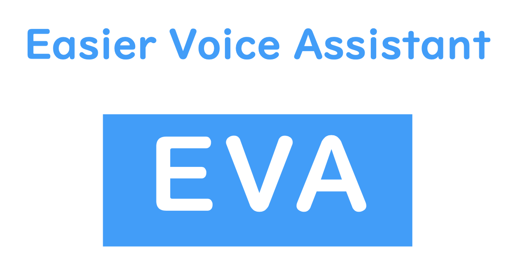
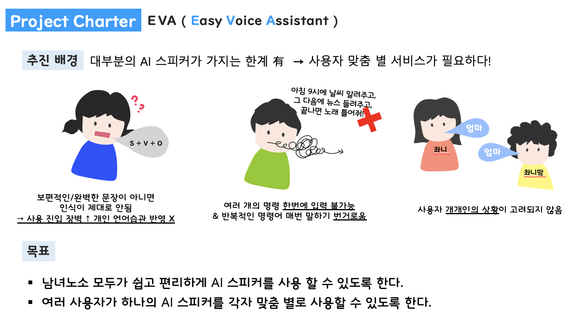
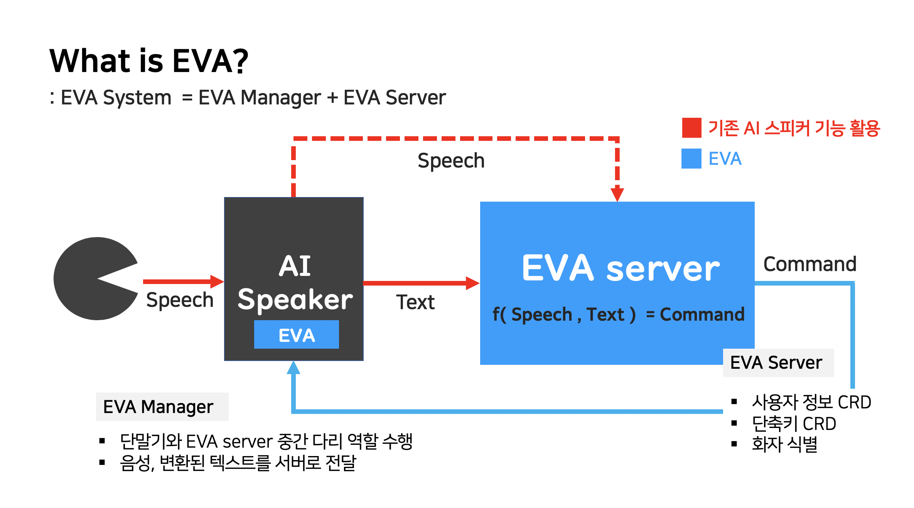

  

    
    
    
    
    

## Table of Contents

- [Introduction](#introduction)
- [Features](#features)
- [Showcase](#showcase)
- [Feedback](#feedback)
- [Contribution](#contribution)
- [Build with](#build-with)
- [Build Process](#build-process)
- [Authors](#authors)
- [License](#license)

## Introduction
EVA is a speaker recognition and voice shortcut system.

## Features

- Users can register various functions with their own shortcut keys and enjoy them faster and easier.
- By distinguishing the speaker based on the voice, the same voice input performs different functions for each user.

## Showcase

  

  

## Feedback

Please feel free to give us any feedback or feature requests by [opening an issue](https://github.com/ina-uzu/eva/issues).

## Contribution

If you wish to contribute to our project, please please do not hesitate to [contact us](https://github.com/ina-uzu/eva/issues).

## Build with
- [Python3](https://www.python.org/) - Python is an interpreted, high-level, general-purpose programming language.
- [Flask](http://flask.palletsprojects.com/) - Flask provides you with tools, libraries and technologies that allow you to build a web application.
- [Pytorch](https://pytorch.org/) - An open source machine learning framework that accelerates the path from research prototyping to production deployment.

## Build Process
**Docker is required if you wish to develop by yourself.**  

http://54.180.120.132:5000/  

// docker container 목록 보기  
docker ps  ( -a : 실행 중인 것만 보기 옵션)  

// docker image & container 새로 생성 및 run  
docker stop $(docker ps -a -q)  
docker rm $(docker ps -a -q)  
docker rmi  
docker build -t eva .  
docker run -d -p 5000:5000 --name eva eva  

## Authors

* **Min Woo Kim** - *ML engineer* - [JoeyValentine](https://github.com/JoeyValentine)
* **Kyu Yeon Lee** - *ML engineer* - [Destructions](https://github.com/destructions)
* **Ina Song** *Server engineer* - [ina-uzu](https://github.com/ina-uzu)
* **Joohan Lee** *Server engineer* - [joohan1030](https://github.com/joohan1030)

## License

This project is licensed under the MIT License - see the [LICENSE.md](LICENSE.md) file for details

